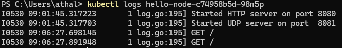
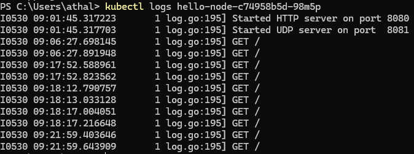
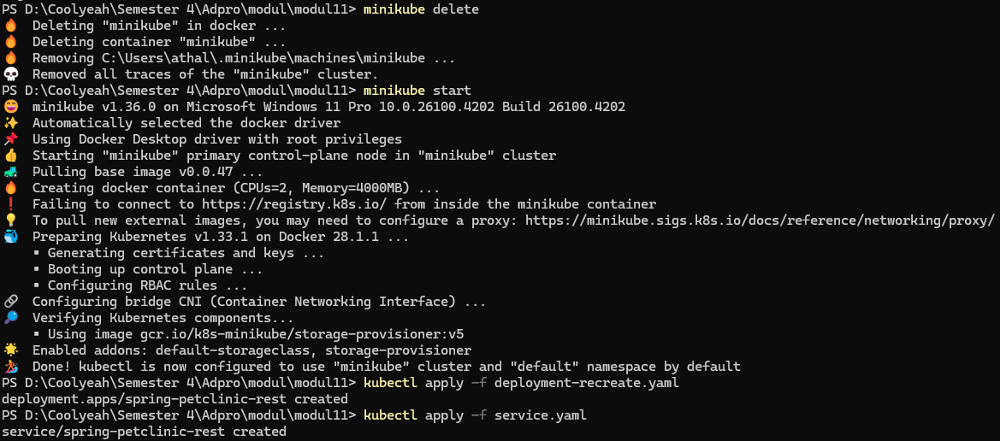
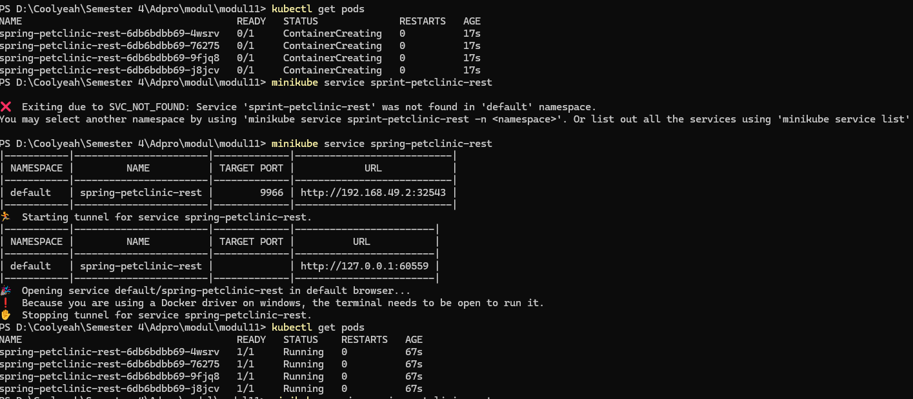

# advprog-modul11

Nama: Athallah Damar Jiwanto <br>
NPM: 2306245024 <br>
Kelas: Advprog-B
<hr>

## Reflection for Hello Minikube

> 1. Compare the application logs before and after you exposed it as a Service. Try to open the app several times while the proxy into the Service is running. What do you see in the logs? Does the number of logs increase each time you open the app?



Dalam pengujian aplikasi Kubernetes, perbedaan signifikan dapat diamati pada log aplikasi sebelum dan sesudah aplikasi di-expose sebagai Service. Analisis terhadap kedua kondisi ini memberikan wawasan penting tentang bagaimana Service Kubernetes mempengaruhi pola traffic dan aktivitas aplikasi.
Pada kondisi awal sebelum aplikasi di-expose sebagai Service, log menunjukkan aktivitas minimal dengan hanya empat baris entry yang mencakup startup HTTP server pada port 8080, inisialisasi UDP server pada port 8081, dan beberapa GET request awal ke root endpoint. Timestamp terakhir tercatat pada 09:06:27, menunjukkan periode aktivitas yang relatif singkat dan terbatas.
Setelah aplikasi berhasil di-expose sebagai Service, terjadi peningkatan dramatis dalam aktivitas aplikasi yang tercermin dari bertambahnya jumlah log menjadi dua belas baris. Log menunjukkan kontinuitas aktivitas hingga timestamp 09:21:59, dengan pola GET request yang konsisten ke endpoint root ("/"). Peningkatan ini mengindikasikan bahwa Service Kubernetes telah berhasil memfasilitasi akses eksternal ke aplikasi, memungkinkan lebih banyak traffic HTTP untuk mencapai Pod aplikasi.
Fenomena peningkatan jumlah log ini membuktikan bahwa setiap kali aplikasi diakses melalui Service, request HTTP tersebut akan tercatat dalam log aplikasi. Hal ini mendemonstrasikan fungsi proxy yang dilakukan oleh Service Kubernetes, dimana setiap akses eksternal diteruskan ke Pod target dan menghasilkan entry log yang berurutan secara kronologis. Dengan demikian, dapat disimpulkan bahwa Service Kubernetes tidak hanya berhasil mem-expose aplikasi untuk akses eksternal, tetapi juga memungkinkan monitoring dan tracking aktivitas aplikasi melalui peningkatan visibility dalam log system.

> 2. Notice that there are two versions of `kubectl get` invocation during this tutorial section. The first does not have any option, while the latter has `-n` option with value set to
`kube-system`. What is the purpose of the `-n` option and why did the output not list the pods/services that you explicitly created?

Opsi -n kube-system digunakan untuk melihat komponen sistem internal Kubernetes, bukan aplikasi yang kita deploy. Untuk melihat aplikasi, gunakan kubectl get tanpa opsi -n (default namespace) atau tentukan namespace spesifik tempat kita men-deploy aplikasi tersebut.

## Rolling Update & Kubernetes Manifest File

> 1. What is the difference between Rolling Update and Recreate deployment strategy?

Strategi Rolling Update mengganti versi aplikasi secara bertahap tanpa menghentikan layanan, sehingga pengguna tetap bisa mengakses aplikasi saat proses update berlangsung. Sedangkan, strategi Recreate akan menghentikan seluruh pod versi lama terlebih dahulu sebelum membuat versi baru, sehingga ada potensi downtime. Sehingga Rolling Update cocok untuk sistem yang butuh ketersediaan tinggi, sedangkan Recreate lebih simpel dan aman untuk kasus di mana downtime tidak masalah.

> 2. Try deploying the Spring Petclinic REST using Recreate deployment strategy and document your attempt.



Mendelete dan mengapply dengan yaml baru, yaitu deployment-recreate.yaml

> 3. Prepare different manifest files for executing Recreate deployment strategy.
Disini saya hanya mengganti strategi dari deployment yang sudah ada di tutorial. 

Dimana pada deployment.yaml menggunakan strategy RollingUpdate:
```
  strategy:
    rollingUpdate:
      maxSurge: 25%
      maxUnavailable: 25%
    type: RollingUpdate
```

Sedangkan deployment-recreate.yaml menggunakan strategi Recreate:

```
strategy:
    type: Recreate
```

> 4. What do you think are the benefits of using Kubernetes manifest files? Recall your experience in deploying the app manually and compare it to your experience when deploying the same app by applying the manifest files (i.e., invoking `kubectl apply -f` command) to the cluster.

Manifest files mengubah deployment dari proses manual yang error-prone menjadi automated, reproducible, dan maintainable process yang essential untuk production environments.